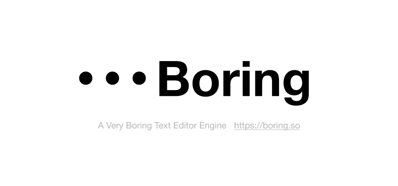

# Boring Engine - the boring text editor engine

> write your document like you code. write in dedicated environment. manage your text contents. 

## Features
- Table
- md style editing
- text node & api (highlighting)
- variables
- placeholders
- [Bridged's G11n](https://github.com/bridgedxyz/G11n) Support
- text node theme api
- live collaborate compatitable api interface (collaboration is not built-in but provides the availability to just plug-in the live feature)

## Other engine projects

- [nothing engine](https://github.com/bridgedxyz/nothing) - nothing but drawing engine.

## Other Projects
other boring related projects are being managed under [github/boringso](https://github.com/boringso)

Visit [boring.so](https://boring.so) for more details
